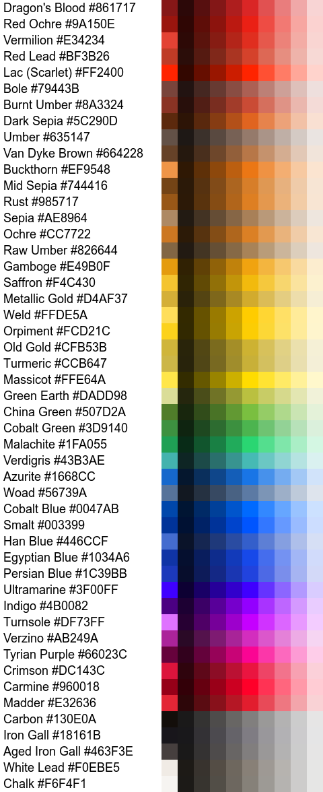

# Medieval_Palette
A collection of modern resources for colors popular in the Medieval era.

Color was prevalent in the Medieval period.  This is a collection of digital color values representing various dyes and pigments used during this part of history.

## Color List

The colors (currently 49) are presented in sections ordered by hue, with alphabetized entries.  Each entry consists of a name, RGB hexadecimal triplets, and CMYK integers.

### Red
* `Carmine           #960018    (  0, 100,  84,  41)`
* `Crimson           #DC143C    (  0, 100, 100,  40)`
* `Dragon's Blood    #861717    (  0,  83,  83,  47)`
* `Lac (Scarlet)     #FF2400    (  0,  86, 100,   0)`
* `Madder            #E32636    (  0,  83,  76,  11)`
* `Red Lead          #BF3B26    ( 18,  90,  99,   7)`
* `Red Ochre         #9A150E    (  0,  86,  91,  40)`
* `Rust              #985717    (  0,  43,  85,  40)`
* `Vermilion         #E34234    (  0,  84,  71,   0)`

### Orange
* `Buckthorn         #EF9548    (  0,  38,  70,   6)`
* `Gamboge           #E49B0F    (  0,  32,  93,  11)`
* `Ochre             #CC7722    (  0,  42,  83,  20)`

### Yellow
* `Massicot          #FFE64A    (  2,   5,  82,   0)`
* `Metallic Gold     #D4AF37    (  0,  20,  70,  20)`
* `Old Gold          #CFB53B    (  0,  13,  71,  19)`
* `Orpiment          #FCD21C    (  0,  17,  89,   1)`
* `Saffron           #F4C430    (  4,  23,  81,   5)`
* `Turmeric          #CCB647    (  0,  11,  65,  20)`
* `Weld              #FFDE5A    (  0,  13,  65,   0)`

### Green
* `China Green       #507D2A    ( 72,  30, 100,  16)`
* `Cobalt Green      #3D9140    ( 58,   0,  56,  43)`
* `Green Earth       #DADD98    (  1,   0,  31,  13)`
* `Malachite         #1FA055    ( 81,   0,  47,  37)`
* `Verdigris         #43B3AE    ( 63,   0,   3,  30)`

### Blue
* `Azurite           #1668CC    ( 89,  49,   0,  20)`
* `Cobalt Blue       #0047AB    (100,  58,   0,  33)`
* `Egyptian Blue     #1034A6    ( 90,  69,   0,  35)`
* `Han Blue          #446CCF    ( 67,  48,   0,  19)`
* `Persian Blue      #1C39BB    ( 85,  70,   0,  27)`
* `Smalt             #003399    (100,  67,   0,  40)`
* `Ultramarine       #3F00FF    ( 75, 100,   0,   0)`
* `Woad              #56739A    ( 44,  25,   0,  40)`

### Purple
* `Indigo            #4B0082    ( 42, 100,   0,  49)`
* `Turnsole          #DF73FF    ( 13,  55,   0,   0)`
* `Tyrian Purple     #66023C    (  0,  98,  41,   6)`
* `Verzino           #AB249A    ( 37,  96,   0,   0)`

### Brown
* `Bole              #79443B    (  0,  44,  51,  53)`
* `Dark Sepia        #5C290D    (  0,  55,  86,  64)`
* `Mid Sepia         #744416    (  0,  41,  81,  55)`
* `Sepia             #AE8964    (  0,  21,  43,  32)`
* `Umber             #635147    (  0,  18,  28,  61)`
* `Burnt Umber       #8A3324    (  0,  63,  74,  46)`
* `Raw Umber         #826644    (  0,  22,  48,  49)`
* `Van Dyke Brown    #664228    (  0,  35,  61,   6)`

### White
* `Chalk             #F6F4F1    (  0,   1,   2,   4)`
* `White Lead        #F0EBE5    (  5,   5,   8,   0)`

### Black
* `Carbon            #130E0A    (  0,  26,  47,  93)`
* `Aged Iron Gall    #463F3E    (  0,  10,  11,  73)`
* `Iron Gall         #18161B    ( 11,  19,   0,  89)`

## Available formats

Two variants of the palette are available in each format.

* Medieval: The base 49 colors
* Medieval With Tints: The base colors each accompanied by eight additional values ranging from 10% to 90% luminosity.

Each formats is generated from color_list.txt.

### GIMP Palette (.gpl)

For use in GIMP, Inkscape, and other which supports the .gpl pallete format.

## Preview

The image below shows the color names and swatches of the corresponding base color followed by tints & shades.  Colors are sorted by hue followed by monochromatics.

